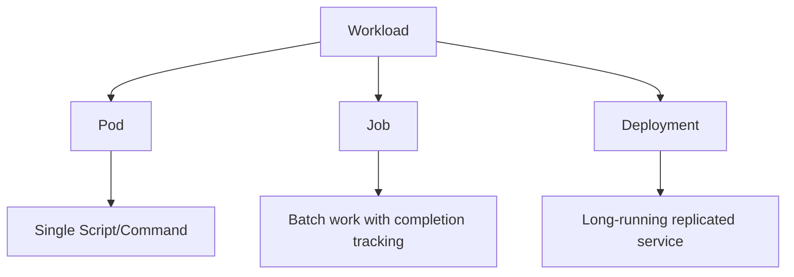
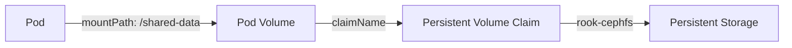

# Introduction to NRP

## The Nautilus Kubernetes Cluster

From container concepts to running workloads

<div class="mt-10 text-sm opacity-70">
Sethuraman Lab Meeting 2 · Hands-on workshop . October 2, 2026
</div>

<!--
Welcome participants and confirm that everyone has access to the NRP portal.
Explain that the session moves from concepts to running Pods and Jobs.
-->

---
layout: center
---

# Learning goals

<v-clicks>

- Explain how NRP, Nautilus, containers, and Kubernetes fit together
- Inspect available compute resources and namespaces
- Submit and inspect a Kubernetes Pod
- Learn how to create a Persistent Volume Claim

</v-clicks>

<!--
Set expectations: deployments are introduced but not covered deeply.
Storage is a bonus section if time permits.
-->

---
layout: two-cols-header
---

# What is the National Research Platform?

::left::

## NRP

A distributed platform that pools:

- Compute
- Storage
- Networking
- Open-weight LLM hosting

Resources are contributed by **70+ institutions** in the United States and around the world.

::right::

## Who can use it?

Researchers and educators at eligible US-based nonprofit institutions can use the platform.

Contributing institutions receive priority access to the hardware they provide.

<div class="mt-8 p-4 rounded bg-blue-50 dark:bg-blue-950">
Shared infrastructure turns geographically distributed hardware into a common research platform.
</div>

<!--
Emphasize that NRP is the broader platform and Nautilus is its Kubernetes hypercluster.
-->


---
layout: two-cols
---

# Enabling technologies

::left::

## Containers

A package containing:

- Application code
- Runtime
- Libraries
- Required dependencies

The same image can run consistently across compatible systems.

::right::

## Kubernetes

An orchestration system that:

- Places containers on compute nodes
- Reserves requested resources
- Restarts or replaces failed workloads
- Manages batch and long-running services

<div class="mt-6 font-semibold">
If software can run in a container, it can usually run on NRP.
</div>

---
layout: iframe-right
url: https://nrp.ai/

class: my-cool-content-on-the-left
preload: true

---

# The NRP portal


Visit **[nrp.ai](https://nrp.ai/)** to access:

- Cluster information
- Available resources
- Your namespaces
- Running Pods
- LLM API key management


<!--
Open the portal and briefly demonstrate where namespaces and available resources appear.
-->


---

# Prerequisites

Before the hands-on exercises, confirm that you have:

<v-clicks>

- Access to [nrp.ai](https://nrp.ai/)
- NRP access through Authentik (Use SDSU Credentials on Single Sign On)
- Membership in at least one namespace
- `kubectl` installed
- The `kubelogin` plugin installed
- A Kubernetes configuration file at `~/.kube/config` downloaded from NRP


</v-clicks>

<div class="mt-8 text-sm opacity-70">
The namespace determines where your workloads and storage objects are created.
</div>

<!--
Pause here to troubleshoot access before participants begin creating resources.
-->

---
layout: section
---

# Kubernetes workloads

Pods, Jobs, and Deployments

---
layout: center
---

# Three Possible Workflows on NRP.



<!--
Frame these as different controllers or abstractions for different workload lifecycles.
-->

---

# Pods

A **Pod** is the smallest deployable unit in Kubernetes.

- Contains one or more tightly coupled containers
- Runs on a single compute node
- Receives CPU and memory allocations
- Ends when its process completes or the Pod is deleted

<div class="mt-8 p-4 rounded bg-green-50 dark:bg-green-950">
For this exercise, the Pod prints a message and sleeps long enough for us to inspect it.
</div>

---

# A Wild Kubernetes Recipe Appears 😲

```yaml {maxHeight:'390px'}
apiVersion: v1
kind: Pod
metadata:
  name: test-pod-<username>
spec:
  containers:
    - name: mypod
      image: ubuntu
      resources:
        limits:
          memory: 100Mi
          cpu: 100m
        requests:
          memory: 100Mi
          cpu: 100m
      command:
        - sh
        - -c
        - echo 'Hello from NRP!' && sleep 3600
```

<!--
Click 1: identify the object and unique name.
Click 2: identify the image and resource settings.
Click 3: explain the command and why the Pod sleeps.
-->

---
layout: two-cols-header
---

::left::

# Reading the manifest

```yaml {1-4|5-8|all}{maxHeight:'390px'}
apiVersion: v1
kind: Pod
metadata:
  name: test-pod-<username>
spec:
  containers:
    - name: mypod
      image: ubuntu
```

::right::

## Identity

- `apiVersion: v1` uses the core Kubernetes API
- `kind: Pod` declares the object type
- `metadata.name` assigns the Pod name

## Desired state

- `spec` describes the intended configuration
- `containers` lists containers in the Pod

<style>
.two-cols-header {
  column-gap: 50px; /* Adjust the gap size as needed */
}
</style>

---
layout: two-cols-header
---

# Reading the manifest

::left::

```yaml {1-4|5-8|all}{maxHeight:'390px'}
resources:
      limits:
        memory: 100Mi
        cpu: 100m
      requests:
        memory: 100Mi
        cpu: 100m
    command: ["sh", "-c", "echo 'Hello from NRP!' && sleep 3600"]

```

::right::

- `resources` defines CPU and memory needs
- `command` overrides the image's default command

<div class="mt-7 text-sm opacity-75">
Replace <code>&lt;username&gt;</code> with a unique identifier.
</div>

<div class="mt-8 p-4 rounded bg-green-50 dark:bg-green-950">
The command will print "Hello from NRP" and 💤.
</div>

<style>
.two-cols-header {
  column-gap: 50px; /* Adjust the gap size as needed */
}
</style>

---
layout: two-cols-header
---

# Requests versus limits

::left::

## Requests

Resources Kubernetes reserves when scheduling:

```yaml
requests:
  memory: 100Mi
  cpu: 100m
```

- `100m` CPU = 0.1 CPU core
- `100Mi` = 100 mebibytes of memory

::right::

## Limits

The maximum resources the container may use:

```yaml
limits:
  memory: 100Mi
  cpu: 100m
```

- CPU use above the limit is throttled
- Exceeding the memory limit can terminate the container

<!--
Emphasize that accurate requests improve scheduling and shared-cluster efficiency.
-->

---

# Run and inspect the Pod

```bash
# Create the Pod from a saved manifest
kubectl apply -f pod.yaml -n <namespace>

# Inspect its status
kubectl get pods -n <namespace>

# View detailed scheduling and event information
kubectl describe pod test-pod-<username> -n <namespace>

# Read the container output
kubectl logs test-pod-<username> -n <namespace>
```

<div class="mt-6 p-3 rounded bg-blue-50 dark:bg-blue-950">
If a Pod remains <code>Pending</code>, inspect its events for scheduling or resource constraints.
</div>

<!--
Run the commands live. Point out READY, STATUS, RESTARTS, and AGE.
-->

---
layout: default
---

# Demo


<div class="flex-1 min-h-0">
  <Terminal  />
</div>


---


# Clean up

```bash
kubectl delete pod test-pod-name -n [namespace]
```

Why clean up?

<v-clicks>

- Releases shared CPU and memory
- Prevents abandoned workloads
- Keeps your namespace easier to understand
- Builds good shared-cluster habits

</v-clicks>

---
layout: section
---

# Kubernetes Jobs

Reliable batch workloads

---

# Why use a Job?

A **Job** creates and tracks one or more Pods until the requested work completes successfully.

Use Jobs for:

- Data processing
- Bioinformatics pipelines
- Simulations
- Model training steps
- Any finite batch workload

<div class="mt-8 p-4 rounded bg-purple-50 dark:bg-purple-950">
Unlike a standalone Pod, a Job records completion and can retry failed Pods.
</div>

---

# Simple Job recipe (Single Pod)

```yaml {1-17|18-20}{maxHeight:'405px'}
apiVersion: batch/v1
kind: Job
metadata:
  name: simple-job-<username>
spec:
  template:
    spec:
      containers:
        - name: simple-container
          image: ubuntu
          command:
            - sh
            - -c
            - echo 'Hello from NRP Job!' && date && exit 0
          resources:
            requests: { memory: 100Mi, cpu: 100m }
            limits: { memory: 100Mi, cpu: 100m }
      restartPolicy: Never
  backoffLimit: 1
  ttlSecondsAfterFinished: 300
```

<!--
Explain the Pod template, restart policy, retry limit, and automatic cleanup timer.
-->

---
layout: two-cols-header
---

# Controlling batch execution

::left::

## Completions

Total number of successful Pods the Job must finish:

```yaml
completions: 5
```

::right::

## Parallelism

Maximum number of Pods that may run simultaneously:

```yaml
parallelism: 5
```

<div class="mt-8 p-4 rounded bg-amber-50 dark:bg-amber-950">
If sufficient resources are unavailable, some Pods remain queued until capacity is available.
</div>

<style>
.two-cols-header {
  column-gap: 50px; /* Adjust the gap size as needed */
}
</style>

---

# Parallel Job

```yaml {5-7}{maxHeight:'405px'}
apiVersion: batch/v1
kind: Job
metadata:
  name: simple-job-<username>
spec:
  completions: 5
  parallelism: 5
  template:
    spec:
      containers:
        - name: simple-container
          image: ubuntu
          command:
            - sh
            - -c
            - echo 'Hello from NRP Job!' && date && exit 0
          resources:
            requests: { memory: 100Mi, cpu: 100m }
            limits: { memory: 100Mi, cpu: 100m }
      restartPolicy: Never
  backoffLimit: 1
  ttlSecondsAfterFinished: 300
```

---

# Inspect the Job

```bash
# Submit the Job
kubectl apply -f job.yaml -n <namespace>

# Check Job completion
kubectl get jobs -n <namespace>

# List Pods created by the Job
kubectl get pods \
  -l job-name=simple-job-<username> \
  -n <namespace>

# View output from one Pod
kubectl logs <pod-name> -n <namespace>
```

<!--
Ask participants to compare the Job status with the statuses of its child Pods.
-->

---
layout: two-cols
---

# Key Job settings

## `restartPolicy: Never`

Failed containers are not restarted inside the same Pod.

## `backoffLimit: 1`

The Job permits at most one retry after failure.

::right::

## `ttlSecondsAfterFinished: 300`

Kubernetes cleans up the finished Job and its Pods after five minutes.

<div class="mt-8 text-sm opacity-70">
Choose retry and cleanup settings based on the workload and debugging needs.
</div>

---

# Deployments

A **Deployment** manages a set of identical Pods and supports live updates.

Typical uses:

- Web applications
- APIs
- Dashboards
- Long-running services
- Replicated inference servers

<div class="mt-8 p-4 rounded bg-gray-100 dark:bg-gray-900">
Deployments deserve a dedicated session: they introduce replicas, Services, health checks, rollouts, and networking.
</div>

---
layout: section
---

# Bonus: Persistent storage

Keeping data after a Pod ends

---
layout: two-cols-header
---

# Ephemeral versus persistent storage

::left::

## Node-local storage

- Exists on the compute node
- Useful for temporary files
- Disappears with the Pod
- Should not hold irreplaceable results

::right::

## Persistent Volume Claim

- Requests durable cluster storage
- Mounts into a Pod at a chosen path
- Survives Pod completion
- Can be reused by later workloads

---

# Create a Persistent Volume Claim

```yaml {1-5|6-12|all}
apiVersion: v1
kind: PersistentVolumeClaim
metadata:
  name: cephfs-pvc-<username>
spec:
  accessModes:
    - ReadWriteMany
  resources:
    requests:
      storage: 1Gi
  storageClassName: rook-cephfs
```

<div class="mt-7 p-4 rounded bg-green-50 dark:bg-green-950">
<code>ReadWriteMany</code> allows multiple Pods to read and write the same volume.
</div>

---

# Attach the PVC to a Pod

```yaml {7-13|14-18|all}{maxHeight:'410px'}
apiVersion: v1
kind: Pod
metadata:
  name: cephfs-pod-<username>
spec:
  containers:
    - name: cephfs-container
      image: ubuntu
      command:
        - sh
        - -c
        - echo "Data written at $(date)" > /shared-data/test.txt
          && cat /shared-data/test.txt && sleep 3600
      volumeMounts:
        - name: cephfs-volume
          mountPath: /shared-data
  volumes:
    - name: cephfs-volume
      persistentVolumeClaim:
        claimName: cephfs-pvc-<username>
```

<!--
Connect volumeMounts in the container to volumes at the Pod level and then to the PVC name.
-->

---
layout: center
---

# Storage flow



<div class="mt-8 text-center opacity-80">
The Pod can be deleted while the data remains in the persistent volume.
</div>

---

# Hands-on challenge

<v-clicks>

1. Create a uniquely named Pod
2. Confirm it reaches `Running`
3. Read its logs
4. Delete it
6. Inspect its Pods and logs
7. If time permits, write a file to a PVC and read it from a second Pod

</v-clicks>

<div class="mt-8 p-4 rounded bg-blue-50 dark:bg-blue-950">
Use your assigned namespace and replace every placeholder before submitting a manifest.
</div>
---
layout: end
---

# Questions?

<style>
h1 {
  font-size: 3.04rem; /* default text-4xl (2.25rem) increased by 35% */
}
</style>

<div class="mt-6 flex justify-center">
  
</div>

[nrp.ai](https://nrp.ai/)